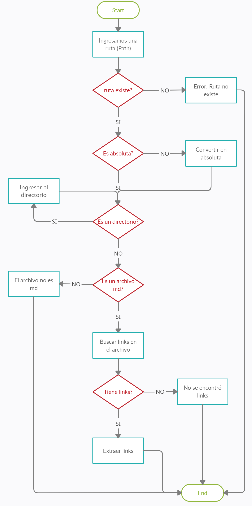
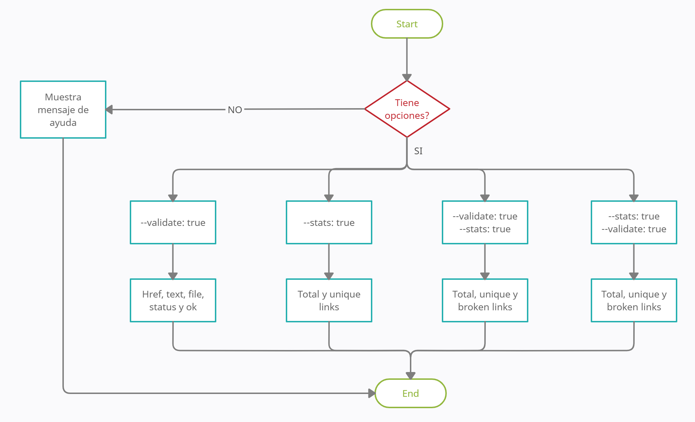

# Markdown Links

## Índice

- [1. Resumen del proyecto](#2-resumen-del-proyecto)
- [2. Diagrama de flujo](#2-diagrama-de-flujo)
- [3. Guía de uso](#3-guía-de-uso)

---

## 1. Resumen del proyecto

`mdLinks` es una librería desarrollada en [Node.js](https://nodejs.org/), que permite leer y analizar archivos con extensión `Markdown(.md)`, para verificar(válidos o rotos) los links que contengan y reportar algunas estadísticas.

## 2. Diagrama de flujo

### API



### CLI




## 3. Guía de uso

### Instalación

Instala la librería con npm

```js
npm i grellatas-mdlinks
```

Instala la librería con GitHub

```js
npm install grellatas-mdlinks
```

### Uso de librería

```js
const mdLinks = require('grellatas-mdlinks');
```
El módulo debe importarse en otros scripts de `Node.js` y ofrece la siguiente interfaz.

`mdLinks(path, options)`

#### Argumentos

- `path`: Ruta **absoluta** o **relativa** al **archivo** o **directorio**.
  Si la ruta pasada es relativa, debe resolverse como relativa al directorio
  desde donde se invoca node - _current working directory_).
- `options`: Un objeto con **únicamente** la siguiente propiedad:
  - `validate`: Booleano que determina si se desea validar los links
    encontrados.

#### Valor de retorno

La función debe **retornar una promesa** (`Promise`) que **resuelva a un arreglo**
(`Array`) de objetos (`Object`), donde cada objeto representa un link y contiene
las siguientes propiedades

Con `validate:false` :

- `href`: URL encontrada.
- `text`: Texto que aparecía dentro del link (`<a>`).
- `file`: Ruta del archivo donde se encontró el link.

Con `validate:true` :

- `href`: URL encontrada.
- `text`: Texto que aparecía dentro del link (`<a>`).
- `file`: Ruta del archivo donde se encontró el link.
- `status`: Código de respuesta HTTP.
- `ok`: Mensaje `fail` en caso de fallo u `ok` en caso de éxito.

#### Ejemplo (resultados como comentarios)

```js
const mdLinks = require("md-links");

mdLinks("./some/example.md")
  .then((links) => {
    // => [{ href, text, file }, ...]
  })
  .catch(console.error);

mdLinks("./some/example.md", { validate: true })
  .then((links) => {
    // => [{ href, text, file, status, ok }, ...]
  })
  .catch(console.error);

mdLinks("./some/dir")
  .then((links) => {
    // => [{ href, text, file }, ...]
  })
  .catch(console.error);
```

### Uso de interfaz de línea de comando)

El ejecutable de la aplicación se ejecuta de la siguiente manera a través de la **terminal**:

`md-links <path-to-file> [options]`

Por ejemplo:

```sh
$ md-links ./some/example.md
./some/example.md http://algo.com/2/3/ Link a algo
./some/example.md https://otra-cosa.net/algun-doc.html algún doc
./some/example.md http://google.com/ Google
```

El comportamiento por defecto no debe validar si las URLs responden ok o no, solo debe identificar el archivo markdown (a partir de la ruta que recibe como argumento), analizar el archivo Markdown e imprimir los links que vaya
encontrando, junto con la ruta del archivo donde aparece y el texto que hay dentro del link (truncado a 50 caracteres).

#### Options

##### `--validate`

Si pasamos la opción `--validate`, el módulo debe hacer una petición HTTP para
averiguar si el link funciona o no. Si el link resulta en una redirección a una
URL que responde ok, entonces consideraremos el link como ok.

Por ejemplo:

```sh
$ md-links ./some/example.md --validate
./some/example.md http://algo.com/2/3/ ok 200 Link a algo
./some/example.md https://otra-cosa.net/algun-doc.html fail 404 algún doc
./some/example.md http://google.com/ ok 301 Google
```

Vemos que el _output_ en este caso incluye la palabra `ok` o `fail` después de
la URL, así como el status de la respuesta recibida a la petición HTTP a dicha
URL.

##### `--stats`

Si pasamos la opción `--stats` el output (salida) será un texto con estadísticas
básicas sobre los links.

```sh
$ md-links ./some/example.md --stats
Total: 3
Unique: 3
```

También podemos combinar `--stats` y `--validate` para obtener estadísticas que
necesiten de los resultados de la validación.

```sh
$ md-links ./some/example.md --stats --validate
Total: 3
Unique: 3
Broken: 1
```